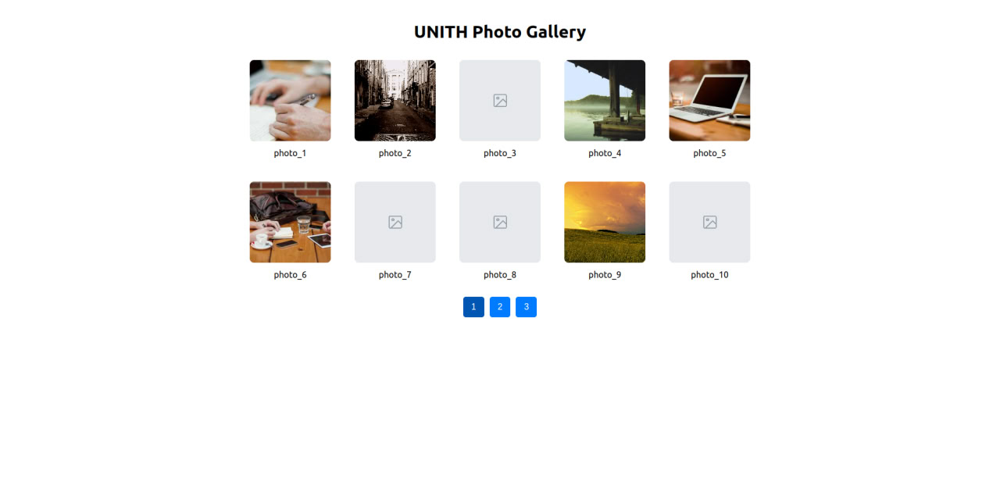

# UNITH App

UNITH photo galery with React and Carousel.

This project was bootstrapped with [Create React App](https://github.com/facebook/create-react-app).

> You should use Node 18.x and latest

### Setup

In the project directory, you can run:

### `npm start`

Runs the app in the development mode on http://localhost:3000.

### `npm test`

Launches the test runner in the interactive watch mode.

### `npm run build`

Builds the app for production to the `build` folder.

### `npm run eject`

**Note: this is a one-way operation. Once you `eject`, you can’t go back!**

If you aren’t satisfied with the build tool and configuration choices, you can `eject` at any time. This command will remove the single build dependency from your project.
